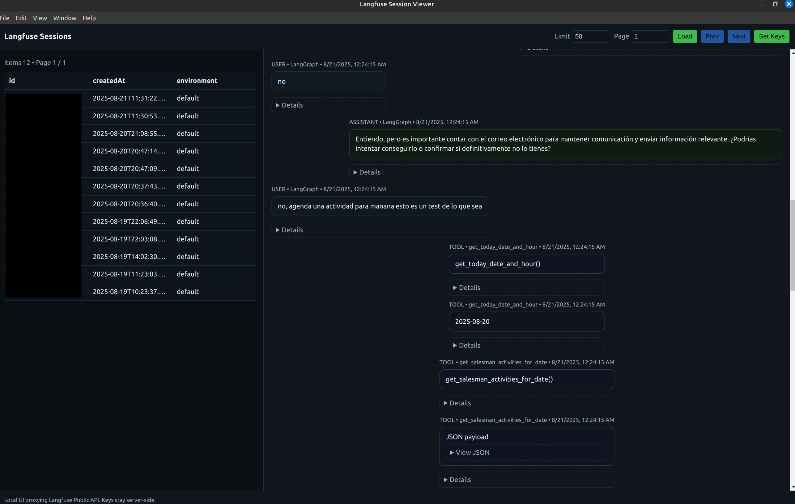

**Langfuse Session Viewer**

A small local/desktop app to browse Langfuse sessions with a readable chat transcript and inline tool calls. It runs as a no‑deps Node server or as a desktop app via Electron. Secrets never reach the browser.

What it does
- Lists sessions with pagination.
- Shows a chat transcript (user/assistant/tool), with inline tool calls and collapsible JSON details.
- Lets you view raw session JSON when needed.

How to run
- Web: `node server.js` → open `http://localhost:5173`
- Desktop: `npm install` → `npm run dev:desktop` (optional: `npm run build:desktop`)

Config
- `.env` (optional in dev): `LANGFUSE_PUBLIC_KEY`, `LANGFUSE_SECRET_KEY`, `LANGFUSE_BASE_URL` (default `https://cloud.langfuse.com`), `PORT` (default `5173`).
- Desktop adds a “Set Keys” button to enter/update keys without editing `.env`.

Security
- Keys stay server‑side (Node/Electron main); the UI only calls the local proxy (`/api`).
- Desktop stores keys at `userData/credentials.json` (0600 perms). `.env` can override in dev.

CLI (optional)
- Fetch via Public API: `LANGFUSE_PUBLIC_KEY=pk LANGFUSE_SECRET_KEY=sk node scripts/langfuse_fetch.js`
